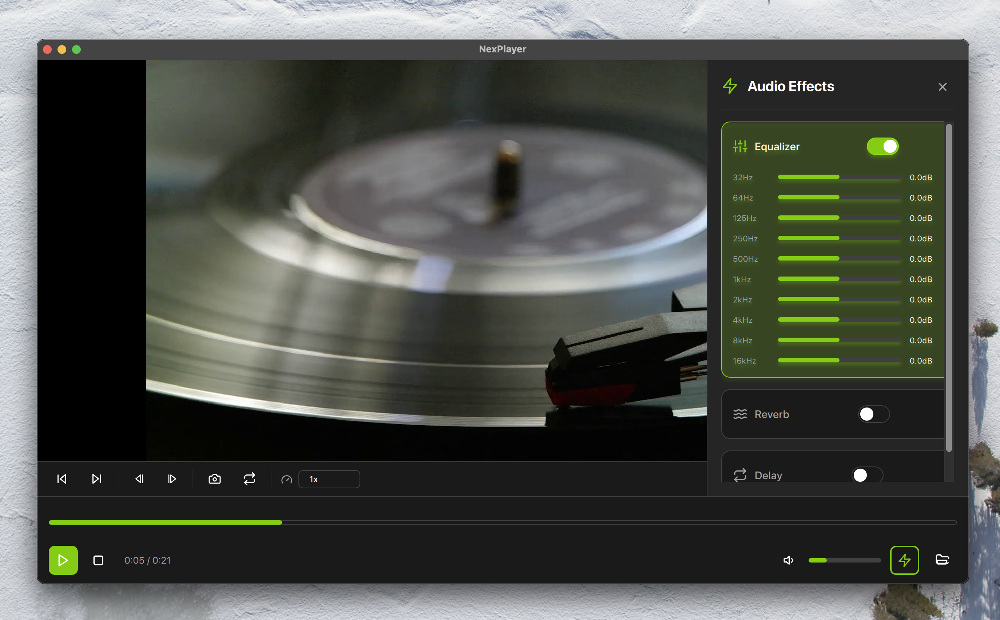
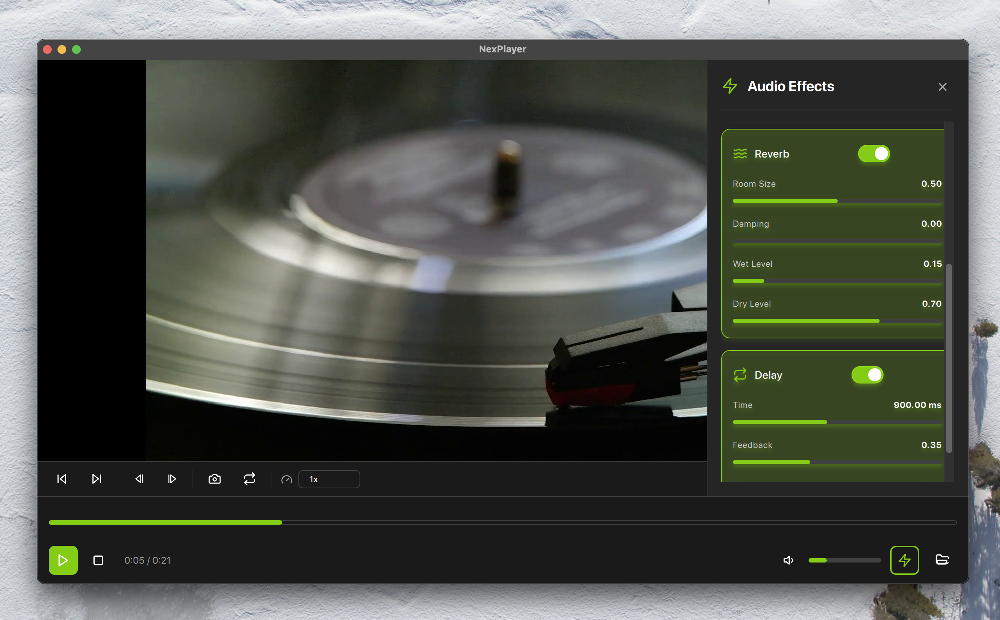
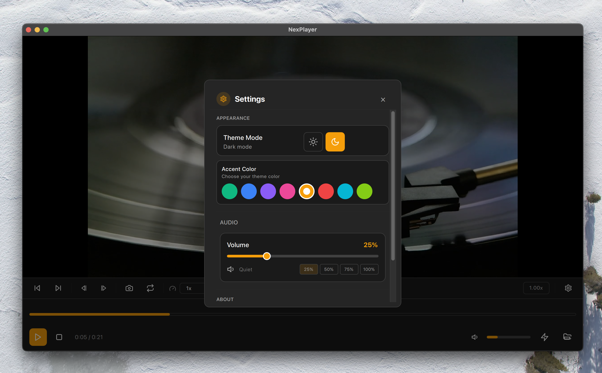

# NexPlayer





A modern, cross-platform media player built with C++, Qt 6, and FFmpeg. Designed for performance, extensibility, and professional audio/video workflows.

## Features

- **High-Performance Playback**: Hardware-accelerated video decoding with FFmpeg
- **Real-Time Audio Effects**: 6-stage effect chain (EQ, Reverb, Delay, Compressor, Flanger, Phaser)
- **Professional Controls**: Frame-stepping, variable playback speed, loop regions, screenshots
- **Modern UI**: Themed interface with glassmorphism, dark/light modes, customizable accent colors
- **Cross-Platform**: Built on Qt 6 for macOS, Linux, and Windows

## Architecture

**Core Components:**
- `VideoPlayer`: Manages playback pipeline and decoding
- `AudioEngine`: Real-time audio processing with effect chain
- `EffectChain`: Modular DSP architecture for audio effects
- `PlayerController`: Qt/QML bridge for UI integration

**Tech Stack:**
- C++17 with modern patterns (RAII, smart pointers, move semantics)
- Qt 6 (QML, Quick, Multimedia)
- FFmpeg (libavcodec, libavformat, libavutil, libswresample, libswscale)
- OpenGL/Metal for video rendering
- CMake build system

## Building

### Prerequisites

- CMake 3.16+
- Qt 6.5+
- FFmpeg 7.0+
- C++17 compiler (Clang/GCC/MSVC)

### macOS

```bash
brew install qt ffmpeg cmake
cd NexPlayer
mkdir build && cd build
cmake ..
make -j$(sysctl -n hw.ncpu)
./NexPlayer.app/Contents/MacOS/NexPlayer
```

### Linux

```bash
sudo apt install qtbase6-dev qtdeclarative6-dev libavcodec-dev libavformat-dev
mkdir build && cd build
cmake ..
make -j$(nproc)
./NexPlayer
```

### Windows

```bash
# Install Qt 6 and FFmpeg via vcpkg or manual installation
mkdir build && cd build
cmake -G "Visual Studio 17 2022" ..
cmake --build . --config Release
```

## Project Structure

```
src/
├── core/           # Playback engine and controller
├── audio/          # Audio processing and effects
├── video/          # Video decoding and rendering
└── utils/          # Helpers and utilities
qml/                # Qt Quick UI components
include/            # Public headers
```

## Audio Effects

| Effect       | Parameters                                    |
|-------------|-----------------------------------------------|
| Equalizer   | 10-band (32Hz - 16kHz), ±12dB per band       |
| Reverb      | Room size, damping, wet/dry mix               |
| Delay       | Time (1-2000ms), feedback, mix                |
| Compressor  | Threshold, ratio, attack, release, makeup gain|
| Flanger     | Depth, rate, feedback, mix                    |
| Phaser      | Depth, rate, feedback, stages (2-12), mix     |

## Codec Support

Supports 300+ codecs via FFmpeg including:
- **Video**: H.264, H.265/HEVC, VP8/VP9, AV1, ProRes, MPEG-4
- **Audio**: AAC, MP3, Opus, FLAC, AC3, DTS, PCM
- **Containers**: MP4, MKV, AVI, MOV, WebM, FLV

## Keyboard Shortcuts

| Shortcut          | Action                    |
|-------------------|---------------------------|
| `Space`           | Play/Pause                |
| `Ctrl+O`          | Open File                 |
| `→` / `←`         | Skip Forward/Backward 10s |
| `Shift+→` / `←`   | Frame Step                |
| `Ctrl+S`          | Screenshot                |
| `L`               | Toggle Loop               |

## Contributing

This is a professional-grade codebase. Contributions should:
- Follow existing architecture patterns
- Include minimal, focused commits
- Avoid unnecessary dependencies or complexity
- Maintain cross-platform compatibility

## License

MIT License - see [LICENSE](LICENSE) for details.

## Acknowledgments

Built with FFmpeg libraries licensed under LGPL v2.1+. Qt framework used under LGPL v3.

---

**Note**: This is production-quality software designed for developers familiar with multimedia programming, C++, and Qt. For basic media playback needs, consider VLC or mpv.